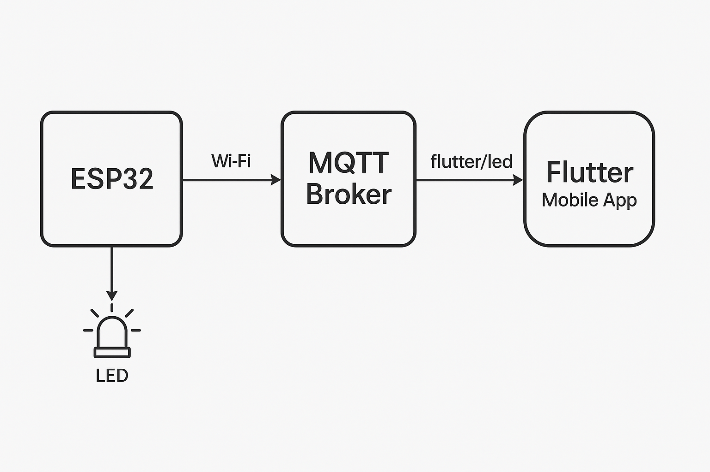

# Smart Home ESP32 Project



## Overview

This project is a smart home system based on the ESP32 platform, developed using PlatformIO and Arduino framework. It allows you to control front and behind LEDs via serial commands, and is structured for easy extension to more devices and features.

## Features

- **WiFi Connectivity:** Easily connect your ESP32 to a WiFi network.
- **Serial Command Control:** Control LEDs by sending commands over the serial port.
- **Modular Code Structure:** Organized into controllers, models, and command handlers for maintainability.

## Serial Commands

| Command | Action             |
|---------|--------------------|
|   1     | Turn ON Front LED  |
|   2     | Turn OFF Front LED |
|   3     | Turn ON Behind LED |
|   4     | Turn OFF Behind LED|

## File Structure

```
src/
  command/led/commands.h, commands.cpp   # Serial command handling
  controller/front_led/FrontLED.h, .cpp  # Front LED control
  controller/behind_led/BehindLED.h, .cpp# Behind LED control
  model/led/LED.h, .cpp                  # Abstract LED class
  main.cpp                               # Main application entry
platformio.ini                           # PlatformIO configuration
```

## Getting Started

1. **Clone this repository.**
2. **Open with [PlatformIO](https://platformio.org/) in VS Code.**
3. **Connect your ESP32 board.**
4. **Edit `platformio.ini` if needed (e.g., WiFi credentials, board type).**
5. **Upload the code to your ESP32.**
6. **Open the Serial Monitor at 115200 baud.**
7. **Send commands (`1`, `2`, `3`, `4`) to control the LEDs.**

## Requirements

- ESP32 DevKit (or compatible)
- PlatformIO extension for VS Code
- Data-capable USB cable